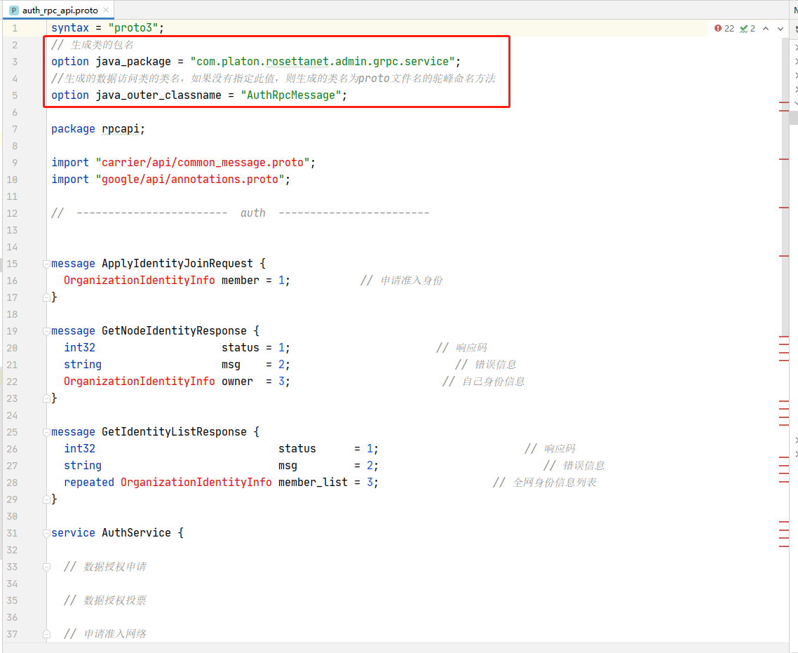
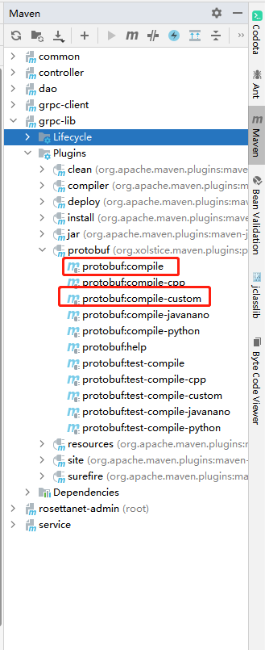
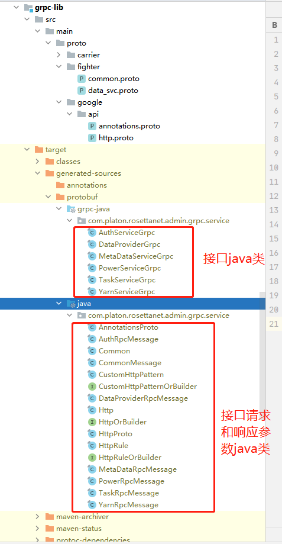
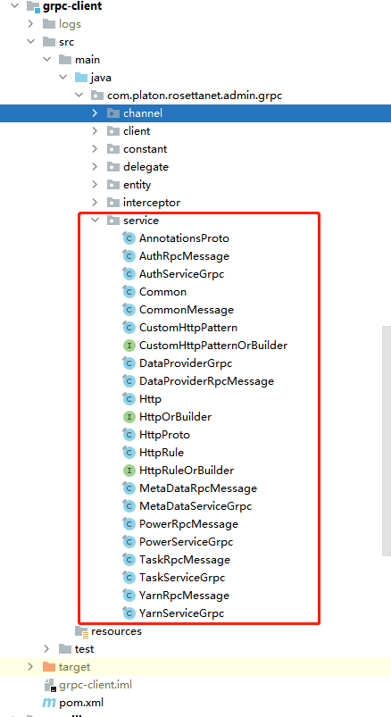

# 更新grpc接口步骤

## 1.从接口定义库里面同步proto文件
[接口定义库](http://192.168.9.66/RosettaFlow/armada-common)
## 2.修改每个proto文件中的部分配置
```
// 生成类的包名
option java_package = "com.platon.rosettanet.admin.grpc.service";
//生成的数据访问类的类名，如果没有指定此值，则生成的类名为proto文件名的驼峰命名方法
option java_outer_classname = "Common";
```

+ 2.1 java_package定义的是该接口的代码生成后的包名
+ 2.2 java_outer_classname定义的是接口的请求参数bean和响应参数bean的外部类名称，
比如A接口的请求参数是Request类型，那么java_outer_classname = "Common"后就会生成Common.Request

## 3.根据接口文件生成java代码
依次运行grpc-lib下的插件任务

## 4.复制java代码到指定的目录
+ 4.1复制grpc-lib/target/generated-sources/protobuf文件夹下的java文件

+ 4.2覆盖grpc-client/src/main/java/service/目录下的文件
